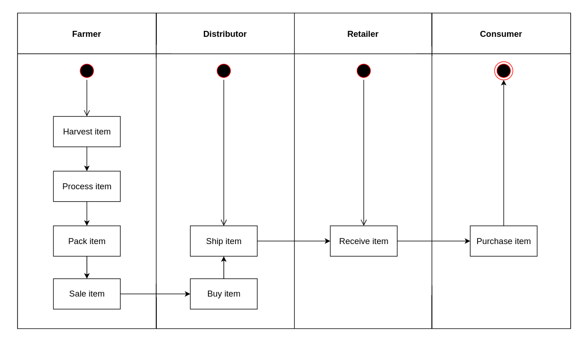
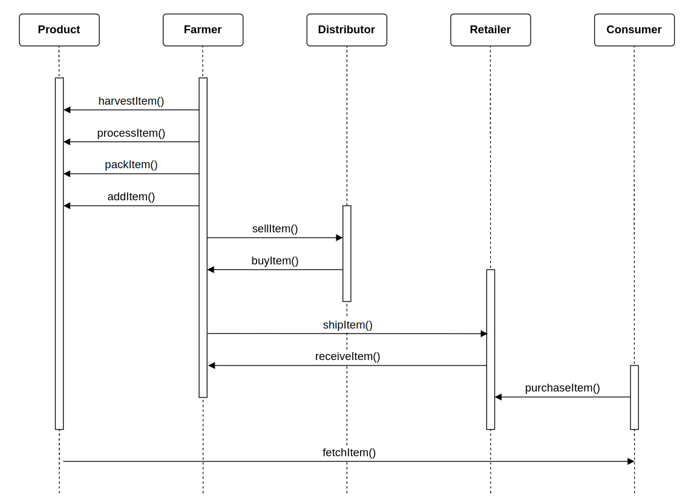
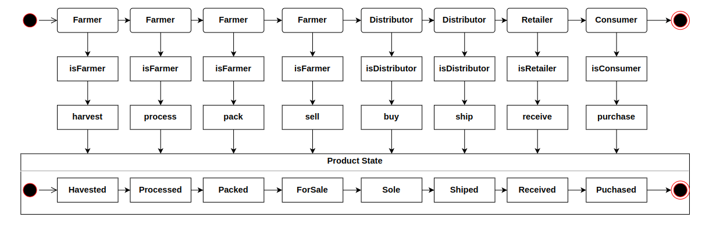
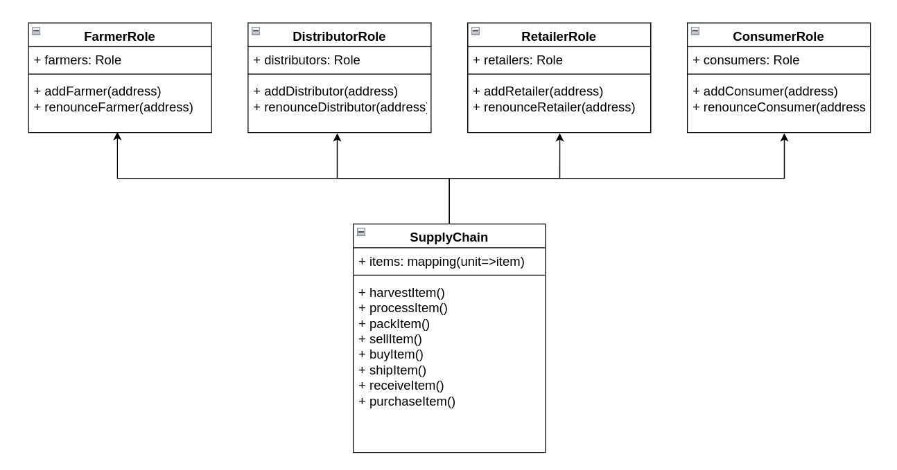
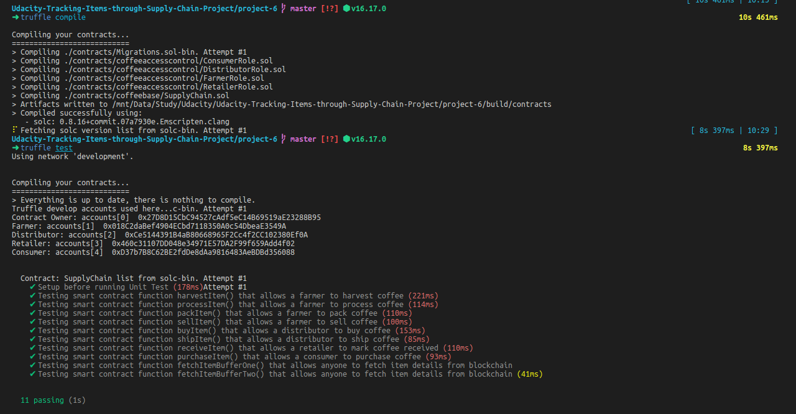
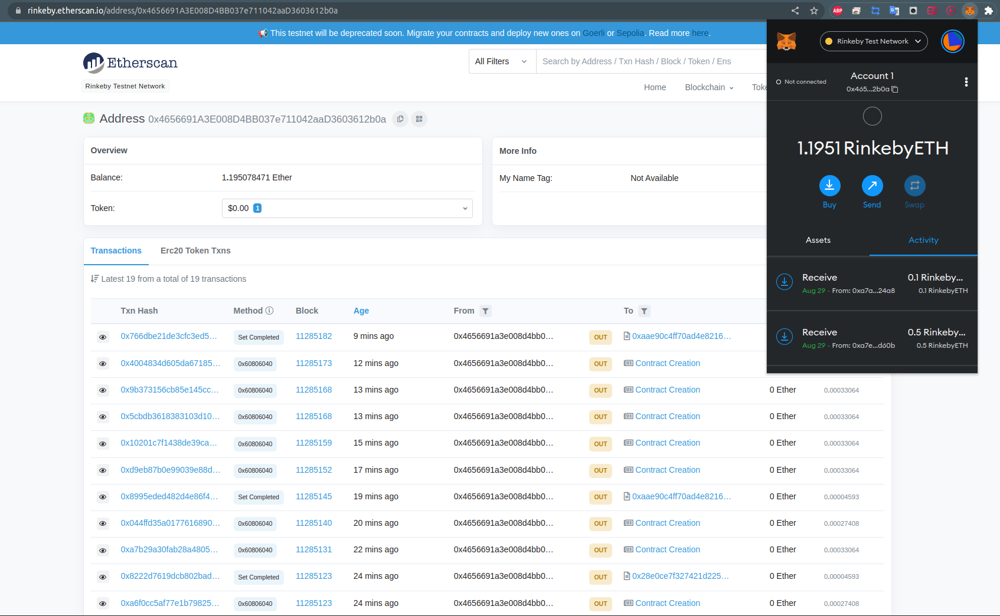

# PROJECT WRITE-UP

# The contract address:
```
 - Migrations: https://rinkeby.etherscan.io/address/0xAAe90c4ff70Ad4E8216D7b29b8654E39E9ae135A
 - FarmerRole: https://rinkeby.etherscan.io/address/0x3E137FB2f50AE48fd600727FF681284A8F164ec7
 - DistributorRole: https://rinkeby.etherscan.io/address/0x5E130344f1E44d01d3f482FB4873CdA685190982
 - RetailerRole: https://rinkeby.etherscan.io/address/0x2FC3EC36bcD4A7685bbe0C9AEb7f81b44FdA694F
 - ConsumerRole: https://rinkeby.etherscan.io/address/0x6d49a7868C37C35173DCa74337D3c7506fD88117
 - SupplyChain: https://rinkeby.etherscan.io/address/0x522957C6E8BbB6a190d4a61b8c96A9D68402f1d9
```
# Libraries were used.
```
  "devDependencies": {
    "lite-server": "2.4.0"
  },
  "dependencies": {
    "@truffle/contract": "^4.5.23",
    "@truffle/hdwallet-provider": "^2.0.14",
    "dotenv": "^16.0.1",
    "web3": "^1.7.5"
  }
```
# Program version numbers:
    - Truffle v5.5.28 (core: 5.5.28)
    - Ganache v7.4.0
    - Solidity - ^0.8.0 (solc-js)
    - Node v16.17.0
    - Web3.js v1.7.4

# UML Diagram

## Activity


## Sequence


## State


## Class (Data Model)


# Result


